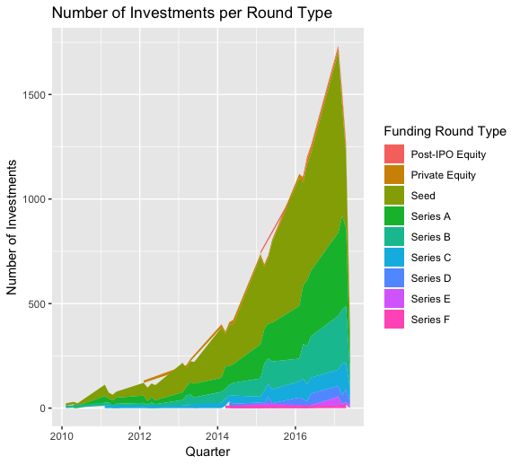
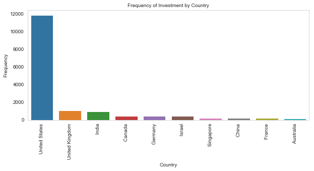
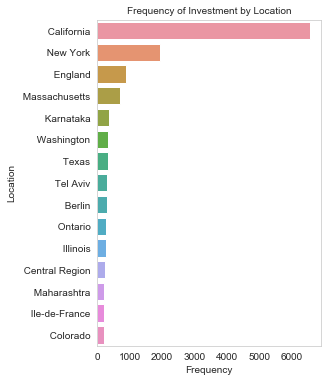
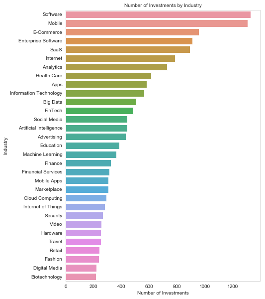
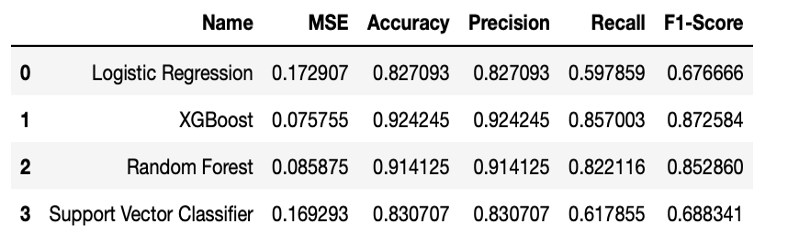
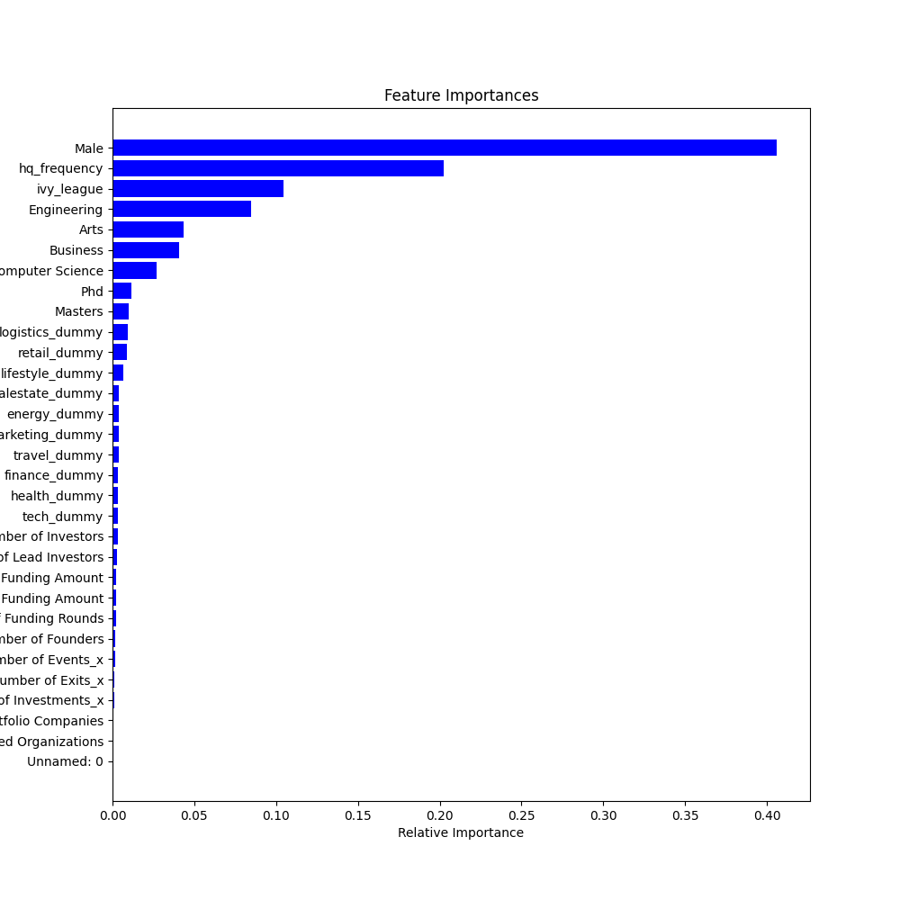

[🚧 Under Construction 🚧]

### Project Objective

Through this project, I aim to help venture capitalists improve accuracy of their investments by understanding whether a start up will be successful through machine learning. A "successful" startup is defained as one that would raise series B funding at minimum.

### Data

For this project, we scraped Crunchbase and LinkedIn for 40,000 founder and startup information from 1968 to 2019.

These are a few notable observations from the data:

The total investment from Series B and above take less than 40% of the total investments. 

Most startup investments come from the US, specifically the states of California and New York.

Unsurprisingly, the top 5 categories that receive the most startup investments are: (1) software, (2) mobile, (3) e-commerce, (4) enterprise software and (5) SaaS.

### Methods and Findings

The K-fold cross validation result is as follows:

I chose random forest and XGBoost. Random forest has decent performance metrics, and provides feature importance. XGBoost, on the other hand, has both highest accuracy (92.42%) and F1-Score (87.26%).

The feature importance provided by random forest is as follows:

### Insights

* Even though the number of founder with business degrees is higher, I was able to deduce that the correlation between a founder succeeding if he has a computer science background is higher with good confidence. This can be due to the growing digital/software/data related startups.
* There is a good chance of a founder succeeding if his alma mater is an Ivy-League/Top-School contrary to the popular belief of being a dropout. We hypothesize this can be true given the great alum network or maybe just the nature of the network a founder is exposed to in an Ivy league.
* Number of founded organisations is negatively correlated which can be attributed to distraction.
* More number of founders is negatively correlated to success. This is consistent with the idea: too many views (people) result into poor decisions.
* Startups with highest number of investments are focussed at portfolio diversification as observed in our market basket analysis.
* Most of the largest VC firms finance late stage rounds and tech companies. So more and more tech startups are blooming and most new start-ups are in the tech category.

### Next Steps

* Apply the selected model on new startup (from 2020 and 2021) and perform qualitative analyses to see if the findings are still relevant
* See how COVID-19 affects startup valuation and adjust models to avoid drift.

### Artifact

* [Github](https://github.com/hnguyen1174/crunchbase_founder_analysis)
* [Project report](https://github.com/hnguyen1174/crunchbase_founder_analysis/blob/master/reports/report.pdf)

