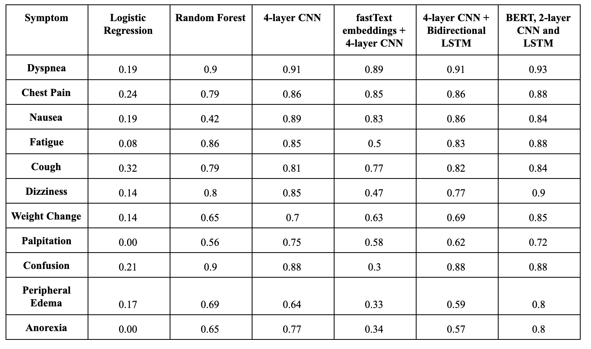
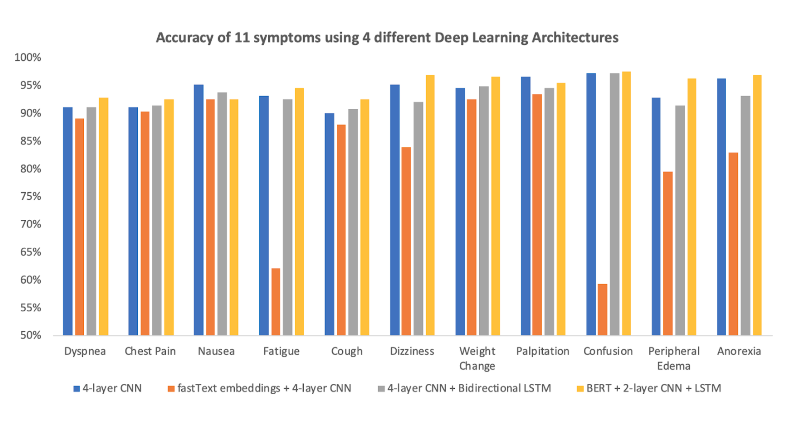

[🚧 Under Construction 🚧]

### Introduction

There are many challenges that are associated with natural language processing in healthcare. Previous studies have shown that the inability to effectively model the subtleties of the medical sublanguage hinder performance. To deal with this problem, practitioners in other fields have attempted to standardize the language before feeding them into machine learning models. However, because of the invariability of the clinical vocabularies and a lack of standardization in medical annotation practices, this is not practical in healthcare. In addition, traditional NLP methods can work with synonyms but not similar terms, so many of them suffer from the curse of dimensionality. 

In the face of such challenges, advanced methods in natural language processing such as CNN, LSTM and BERT are also gaining popularity. For example, Razavian et al utilized one LSTM network and two CNN models to predict multiclass disease onset. Lipton et al used LSTM network to discover patterns from lab measurements and diagnosed based on the discovered patterns. Jagannatha et al. used LSTM and conditional random field to detect entities from full-length clinical notes.

This study investigates whether using deep learning models will result in better predictive performance compared to traditional machine learning methods. 

### Dataset

Our study is conducted on a dataset of discharge notes for patients with heart diseases. The training dataset has 8,031 notes, and the test dataset has 293 notes. The test set is a gold-standard, human-labelled dataset while the training set is generated by NimberMiner. There are eleven symptoms in our datasets. They all have class imbalances: the negative class outnumbers the positive class across symptoms. This adds another layer of difficulty to our task. Some deep learning models that we use, such as BERT, address the issue of class imbalance better than others do. The class imbalance is presented in Table 1 below.

|Symptom|Training Set|Test Set|
|:--:|:--:|:--:|
|Dyspnea|39%|49%|
|Chest Pain|30%|30%|
|Nausea|21%|21%|
|Fatigue|18%|23%|
|Cough|16%|21%|
|Dizziness|14%|15%|
|Weight Change|10%|9%|
|Palpitation|8%|5%|
|Confusion|8%|11%|
|Peripheral Edema|7%|11%|
|Anorexia|5%|8%|

Our notes are in the form of free-text. They do not have strict structure and vary in length based on the symptoms of each patient and their severity. The percentiles of the note lengths are presented below in Table 2.  The training set and the test set are relatively similar in terms of length: the maximum length is 4,547 words for the training set and 4,273 words for the test set, and the average length is 1,025 for the training set and 1,336 for the test set. 

### Method

#### Baseline Models

For this study, we choose logistic regression and random forest as our two baseline models. Logistic regression and random forests have been used widely as predictive models of choice for text classification [15, 16]. For logistic regression, we cast the notes into a sparse matrices before training the model. For random forest, we also cast the notes in sparse matrices, and then used the “ranger” implementation of random forest in the R language, using twenty decision trees and “impurity” as our importance metrics. Among these two baseline models, random forest has been widely used in natural language processing tasks because it is highly interpretable. 

#### Deep Learning Model Training

Traditional natural language processing methods, such as our baseline models, are limited by their vocabulary dictionary for predictive tasks and require complex processing steps. In addition, simplistic models such as logistic regression cannot effectively recognize the semantic relationships between words and n-grams. We choose to perform text classification using word embeddings and convoluted neural networks (CNN) because such models don't have these restrictions. 
We experiment with four different architectures: (1) a 1-layer embedding and 4-layer CNN; (2) a 1-layer fastText embedding and 4-layer CNN and (3) 1-layer embedding, 4-layer CNN followed by a 1-layer Bidirectional Long-short Term Memory (LSTM) and (4) a BERT layer, 2-layer CNN and 1-layer LSTM. We train binary classifications using these three architectures for all eleven symptoms. These models are trained using the Keras library in R with a Tensorflow backend. 

#### BERT (Deep Bidirectional Transformers for Language Understanding)

Open-sourced by Google AI, BERT is an advancement in state-of-the-art NLP techniques. It is the first deeply bidirectional, unsupervised language representation pre-trained on a plain text corpus. Similar to other contextual models, BERT generates a representation for each word using the other words in the sentence. If a unidirectional contextual model represents “I accessed the bank account” by looking at only “I accessed the” and not “account,” BERT represents it by both components from the very bottom of the deep neural net, making it “deeply bidirectional.”

### Results:

We found that deep learning models, on average, produce better performance when compared to traditional machine learning methods. A full comparison can be found in the table below.

Since deep learning models outperform the baseline models, below we present the accuracy and F-score of all eleven symptoms using three different deep learning architectures. 

### Future Extensions

As EHR is becoming ubiquitous and machine learning algorithms for natural language processing are developing very quickly, there are ample opportunities for improvements. There are more features available in our dataset, such as patients’ ages, time and dates of the discharge notes and so on. We can potentially use these features to impose a temporal structure on our data set to not only predict a symptom, but also predict when it will occur in the future.   

### Artifact

* [Github](https://github.com/hnguyen1174/ehr-symptom-detection)
* [Project report (draft)](https://github.com/hnguyen1174/ehr-symptom-detection/blob/master/reports/Paper%20Draft_V3.pdf)