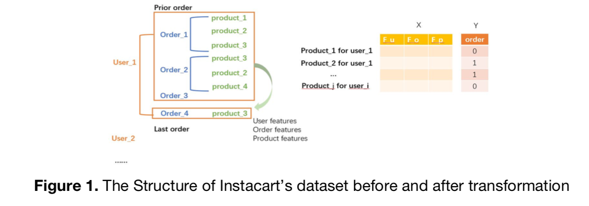
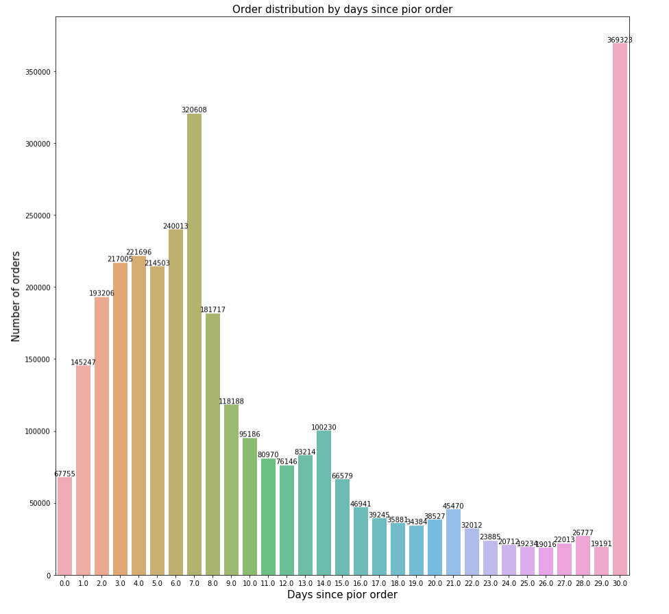
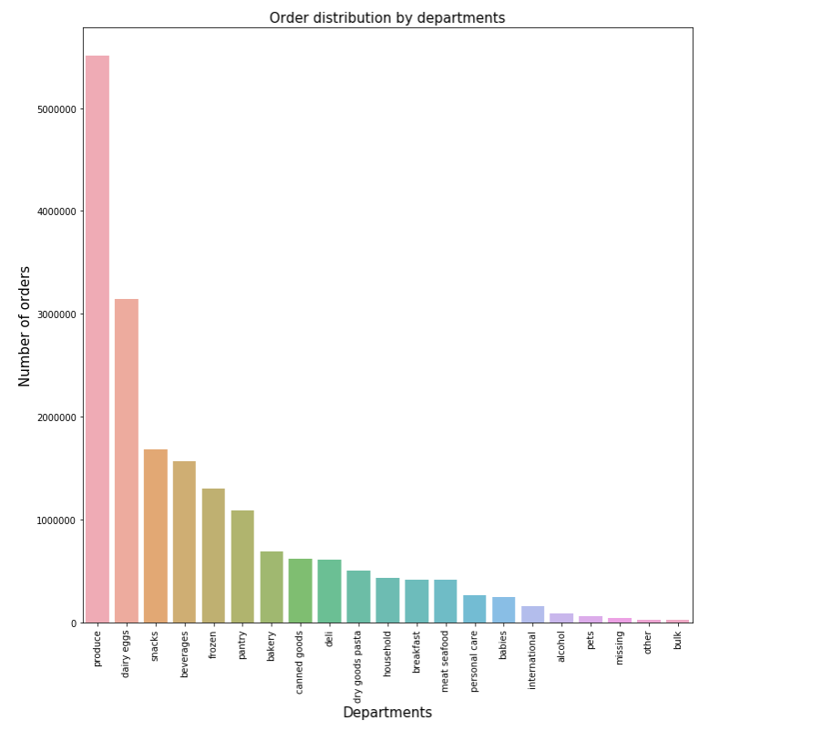
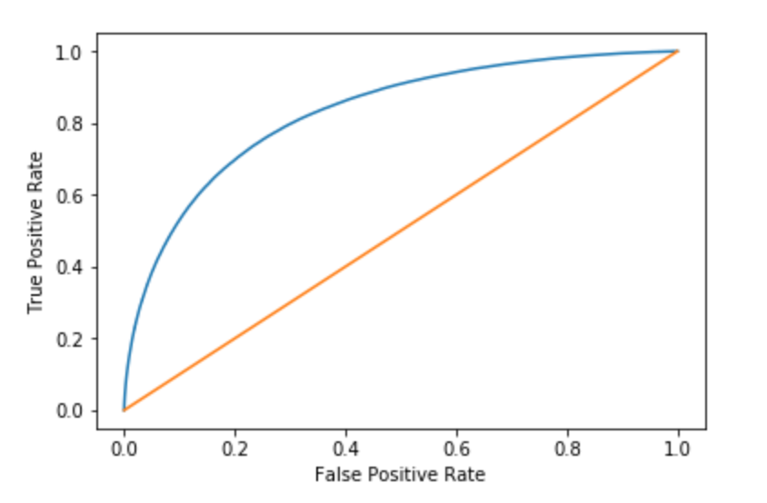

[🚧 Under Construction 🚧]

## Introduction

Instacart is an internet company that operates same-day grocery delivery service. In this project, we explored ways to predict whether an Instacart user would reorder a certain product in his or her next order, which can be used to implement highly personalized marketing strategies. After consolidating and exploring the Instacart datasets, we identified three feature categories, namely user-behavior-based, product-based and user-product-cross-based features. Having processed all available data, we finally decided on using the XGBoost algorithm as the primary model as it yielded the best accuracy of 75%.

## Data

The dataset we used for this project includes 3 million of Instacart’s anonymized customer orders from 200,000 Instacart users (4 - 100 orders for each user). Specifically, “order.csv” specifies all order ids of all customers as well as the time at the order and the time since a customer’s last order. “Order_products_prior.csv” expands each order id that is not the last order of a customer, including in every row the product’s name and sequence he/she puts it in a cart. “Order_products_train.csv” expands all the last order ids of customers, which we turned into labels used for prediction.

## EDA

While we cleaned the data, we also visualized some features and discovered a few interesting observations. The upper plot shows the distribution of orders by days since a prior order. Note that day 7 and day 30+ have extremely high number of orders, suggesting that a user have a higher probability to place an order if he or she hasn’t done so for the past 7 or 30+ days (weekly and monthly basis, respectively). The lower plot shows the distribution of orders among departments. Here we see that products under the “produce” department have a higher probability to be purchased.

## Method

For this project we used XGBoost (Extreme Gradient Boosting) model. Gradient boosting tree is an ensemble learning algorithm that iteratively learn weak classifiers and add them to a final strong classifier to produce final predictions. In each round we learned a new tree to approximate the negative gradient and minimize the losses. The parameters we used for the XGBoost included: “min_child_weight” is the minimum weight that a node can have; “gamma” is the tree size penalty; “subsample” indicates bagging (sampling with replacement a proportion of the training set) to reduce the level of overfitting; “colsample_bytree” allows us to perform bagging on a proportion of features to construct the trees, which also helps to reduce overfitting; “max_depth” is the maximum depth of the tree. The disadvantages of XGBoost are that it is not good at extrapolating unseen values. Therefore if a user nevers bought a product before, our model would never predict it in that user’s reorder basket. Moreover, we split the data into training set and testing set and also did cross-validation to prevent overfitting.

## Insights

The AUROC score for our model using XGBoost is 83%. We also analyzed the feature importance to figure out which features contribute the most to the prediction and explain the most variance in our labels. It turned out that the most important feature was **the number of orders since the previous order**. This feature is a user-product-cross-based feature which was generated by us. Intuitively, it is correct to think that a customer is more likely to buy a product if he has bought it just recently. The second and third important feature are **the reorder rate of a product and the total number of different product the customer has bought before**. 

### Artifact

* [Github](https://github.com/hnguyen1174/instacart-market-basket-analysis)

