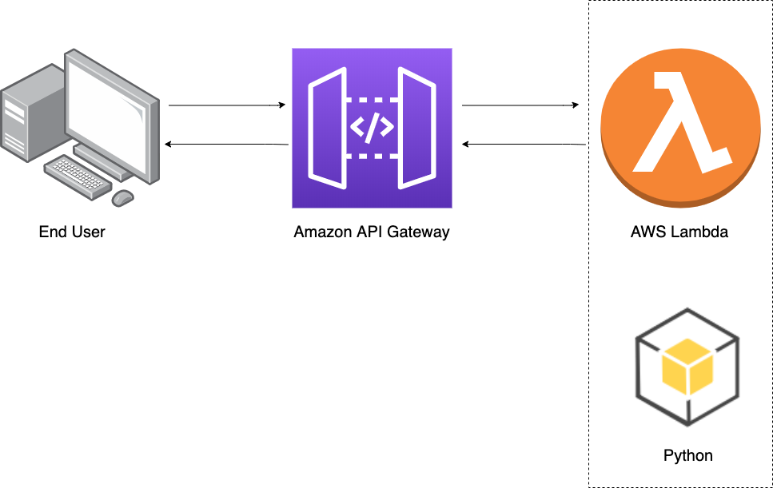

[](https://github.com/hnguyen1174/sagemaker-movie-reviews)

Technologies:

* Python (`torch`) for LSTM
* I trained the models with `AWS SageMaker`. The services I used include: `S3`, `API Gateway` and `Lambda`.

### Introduction

The goal of the project is to have a simple web page which a user can use to enter a movie review. The web page will then send the review off to our deployed model on **[AWS SageMaker](https://aws.amazon.com/sagemaker/)** which will predict the sentiment of the entered review.

### The General Process

1. Retrieve the data.
2. Process and prepare the data.
3. Upload the processed data to [S3](https://aws.amazon.com/s3/) - AWS Cloud Storage.
4. Train the LSTM model.
5. Test the trained model (typically using a batch transform job).
6. Deploy the trained model.
7. Use the deployed model.

### The Data

I used the [IMDb dataset](http://ai.stanford.edu/~amaas/data/sentiment/) for the deployment project.

### The model

I will use a simple LSTM model:

```
class LSTMClassifier(nn.Module):

    def __init__(self, embedding_dim, hidden_dim, vocab_size):
        """
        Initialize the model by settingg up the various layers.
        """
        super(LSTMClassifier, self).__init__()

        self.embedding = nn.Embedding(vocab_size, embedding_dim, padding_idx=0)
        self.lstm = nn.LSTM(embedding_dim, hidden_dim)
        self.dense = nn.Linear(in_features=hidden_dim, out_features=1)
        self.sig = nn.Sigmoid()
        
        self.word_dict = None

    def forward(self, x):
        """
        Perform a forward pass of our model on some input.
        """
        x = x.t()
        lengths = x[0,:]
        reviews = x[1:,:]
        embeds = self.embedding(reviews)
        lstm_out, _ = self.lstm(embeds)
        out = self.dense(lstm_out)
        out = out[lengths - 1, range(len(lengths))]
        return self.sig(out.squeeze())
```

### Deploy the model in SageMaker:

```
from sagemaker.pytorch import PyTorch

estimator = PyTorch(entry_point="train.py",
                    source_dir="train",
                    role=role,
                    framework_version='0.4.0',
                    train_instance_count=1,
                    train_instance_type='ml.p2.xlarge', #'ml.p2.xlarge',
                    hyperparameters={
                        'epochs': 10,
                        'hidden_dim': 200,
                    })
                    
estimator.fit({'training': input_data})

predictor = estimator.deploy(initial_instance_count=1, instance_type='ml.p2.xlarge')
```

and then use the `predictor` to predict on processed text reviews:

```
test_review = 'This movie is fantastic!'

test_review_processed = review_to_words(test_review)
processed_test_review, lengh_test_review = convert_and_pad(word_dict, test_review_processed)
test_data = np.expand_dims(
    np.hstack((lengh_test_review, processed_test_review)), 
    axis=0)
    
predictor.predict(test_data)
```

### Deploy the model using `Lambda function` and `API Gateway`

<p align="center">
  
</p>


* On the far right, we have the LSTM model in Python. 
* On the far left is the web app that reads a movie review, sends it off via a URL and returns a positive or negative sentiment prediction.
* In the middle, we have a Lambda function, which is a Python function that can be executed whenever an event occurs. I will give this function permission to send and receive data from a `SageMaker` endpoint.
* Lastly, the **method** I will use to execute the Lambda function is an endpoint that we will create using `API Gateway`. This endpoint will be a URL that listens for data.

### Simple Interface


### Artifact

* [Github](https://github.com/hnguyen1174/DisasterTweetsDetector)


