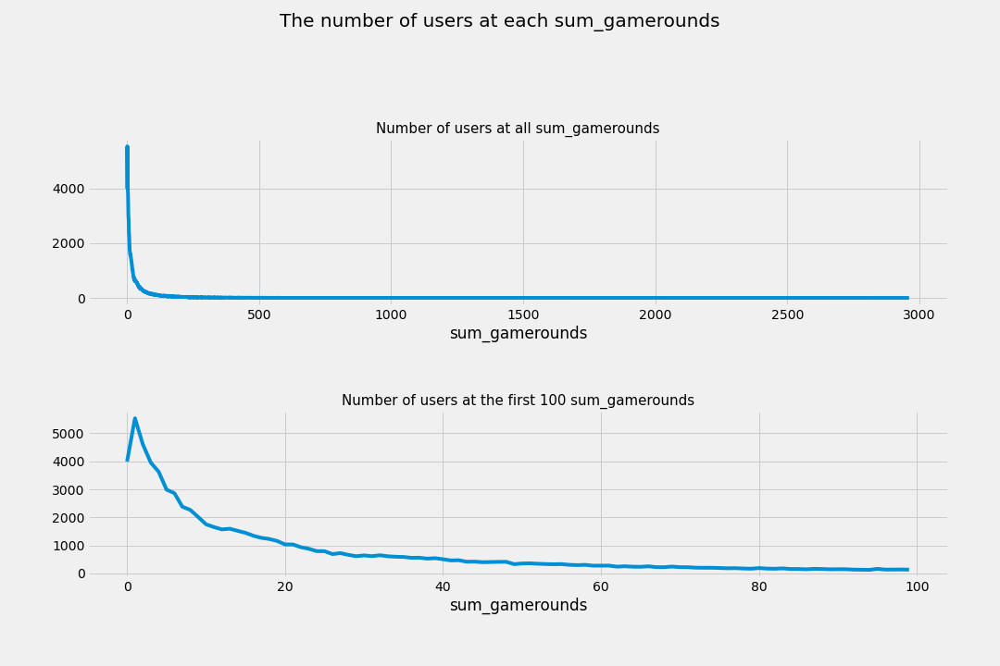
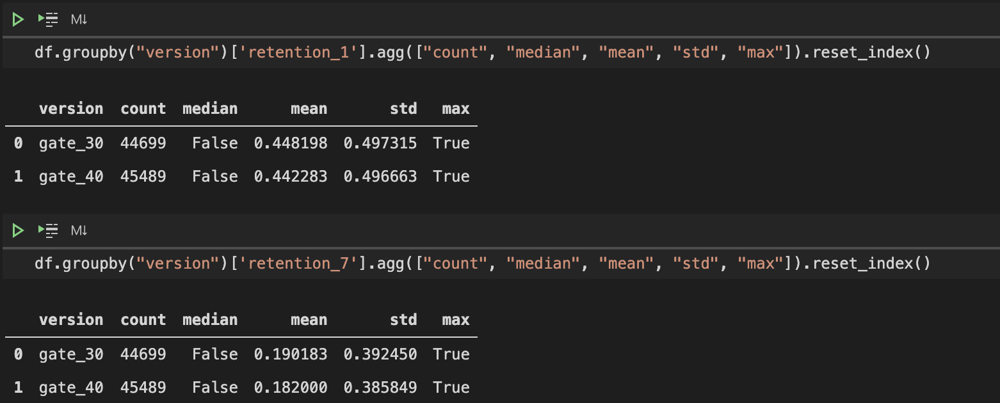
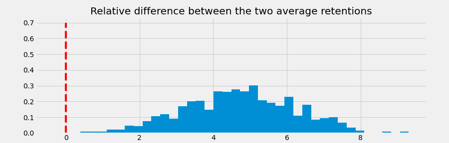

🚧 Under Construction 🚧

Technologies:

* `scipy.stats` for hypothesis testing.
* `PyMC3` for Bayesian statistical modeling

### Introduction

#### Overview

Cookie Cats is a popular mobile puzzle game developed by [Tactile Games](https://tactilegames.com/). This is a classic game where you need to connect three pieces of puzzle of the same type to clear a board and score points.

As players move to higher level, they will see gates that ask them to either wait for a period of time, or make an in-app purchase to progress. In this project, I am interested in performing an A/B test to understand the effect of moving the first gate from level 30 to level 40 on player 1-day and 7-day retention.

Retention is important, as in order to invite players to make in-app purchases at later rounds for monetization, we must first retain players.

While the number of games played is another important feature, I will not test for it in this project.

#### Success Metrics

The project can be deemed successful if:

* From analyses, I can conclude whether moving the first gate from level 30 to level 40 increase or decrease retention.
* I can conclude whether the change is **statistically significant**.

### The Data

The dataset contains 90,189 players that installed the game while the A/B test took place. The features are as follows:

* `userid`: player unique identification
* `version`: whether the player is placed in the control group (`gate_30`; the first gate is placed at level 30) or the test group (`gate_40`; the first gate is placed at level 40).
* `sum_gamerounds`: the number of game rounds played by the player during the **first week** after installation
* `retention_1`: 1-day retention of player after installation
* `retention_7`: 7-day retention of player after installation

### Method

#### Exploratory Data Analysis

**Number of games played**

* Only 59.4% of all users reach Gate 30, and only 65.76% of all users reach Gate 40.
* We can see there is a peak at `sum_gamerounds == 1`. 5538 users only play 1 game.

This points to a significant churn problem. These are a few recommendations:

* Tactile Entertainment should understand why most people only play a few games. Maybe the game is too difficult or not as interesting as other games.
* Tactile Entertainment should understand while there are some people installing the game but not playing it at all. Is there a barrier, such as a bug, that prevents these players from playing the game for the first time?
* Tactile Entertainment should explore avenues to retain users above level 1, such as unlocking features as certain gates or building a more compelling story.

**Note:** There are 3,994 users who installed the game but never played. It is odd that around 20% of these users have `retention_1` as TRUE. A data quality check is needed.

**Retention**

1-day and 7-day retention are not very different between two groups. The difference is bigger for 7-day retention.

The notable thing to point out is that both 1-day and 7-day retention are **higher** for Gate 30 compared to Gate 40.

#### Bootstrapping

While the difference in `retention_1d` and `retention_7d` between `gate_30` and `gate_40` is very small, it can make a big difference when we look at millions of players if the game is grow in the future.

I would like to understand whether the difference is significant. Before A/B testing, I will use bootstrapping: I will re-sample the dataset with replacement for 10,000 times, and calculate 1-day and 7-day retention for those samples.

This will give me an idea of how confident I should be about the difference between gate_30 and gate_40.

#### A/B Hypothesis Testing:

The general procedure to set up an experiment and perform an A/B test is as follows (step 3-6 are already taken care of).

1. Understanding business problem and the data
2. Form a hypothesis and check assumptions
3. Build a randomization strategy
4. Set metrics
5. Choose a sample size
6. Collect the data
7. Perform exploratory data analysis and process data
8. Check normality and homogeneity
9. Apply tests (Shapiro, Levene Test, T-Test, Welch Test, Mann Whitney U Test)
10. Evaluate the results on the metrics
11. Make inferences
12. Make recommendations

Hypothesis Testing Procedure:

#### Bayesian A/B Testing

In this project, I will also carry out a Bayesian A/B test using the `PyMC3` package.

* Priori: uniform distribution [0,1]
* Likelihood: Bernoulli

### Results:

#### Bootstrapping:

After bootstrapping, it seems like moving from gate_30 to gate_40 indeed **lower** 1-day and 7-day retention.

The probability that 1-day retention is greater when the gate is at level 30 is 96.23%.

The probability that 7-day retention is greater when the gate is at level 30 is 99.9%.

#### A/B Hypothesis Testing:

For both 1-day and 7-day retention, I first performed the Shapiro-Wilk test to see if the distribution is normal.

**Shapiro-Wilk Test for normality**

* `H_0`: The null hypothesis for this test is that the data are normally distributed.
* `H_A`: The alternative hypothesis is that the data is not normally distributed.

If the chosen alpha level is 0.05 and the p-value is less than 0.05, then the null hypothesis that the data are normally distributed is rejected. If the p-value is greater than 0.05, then the null hypothesis is not rejected.

In our case, both the control group (`gate_30`) and the treatment group (`gate_40`) are not normally distributed as the p-values are both less than 0.05. Therefore, we will go with the Mann–Whitney instead of a standard t-test. 

**The Mann–Whitney U test** 
(also called the Mann–Whitney–Wilcoxon (MWW), Wilcoxon rank-sum test, or Wilcoxon–Mann–Whitney test) is a nonparametric test:

* `H_0`: null hypothesis that, for randomly selected values X and Y from two populations, the probability of X being greater than Y is equal to the probability of Y being greater than X.
* `H_A`: alternative hypothesis that, for randomly selected values X and Y from two populations, the probability of X being greater than Y is not equal to the probability of Y being greater than X.

In our case, p-value < 0.05, we reject the null hypothesis and **the difference between the control and the treatment group is statistically significant**. It means that moving the gate from level 30 to level 40 actually lower both retention levels (1-day and 7-day).

#### Bayesian A/B Hypothesis Testing:

From the below observations, we have a 95.7% confidence that the retention for Gate 30 is greater than 40 for 1 day.

From the below observations, we have a 99.9% confidence that the retention for Gate 30 is greater than 40 for 7 days.

We observed that placing the gate at Level 30 brought greater retention for both the 1 and 7 days retention.

### Recommendations:

* Using all three methods (bootstrapping, A/B testing and Bayesian A/B testing), there is strong evidence that 1-day and 7-day retention will **decrease** if the gate is to be moved from level 30 to level 40.
* Although there are other metrics to consider, if we want to maintain retention, we **should not** move the gates.
* This result can be counter-intuitive. After all, if the gate moves to a later level, a user will have more time to explore the game and its features. Therefore, one could expect that moving the gate will improve retention.
* A hypothesis is that: breaks in between games can help prolong enjoyment more as people tend to lose interest if they do something for an extended period of time. Therefore, having a gate at a lower level actually **helps** with retention.

### Next Steps:

* [ ] Refactor to offer functions that perform A/B testing and Bayesian testing.

### Artifact

* [Github](https://github.com/hnguyen1174/cookie_cats_ab_testing)

