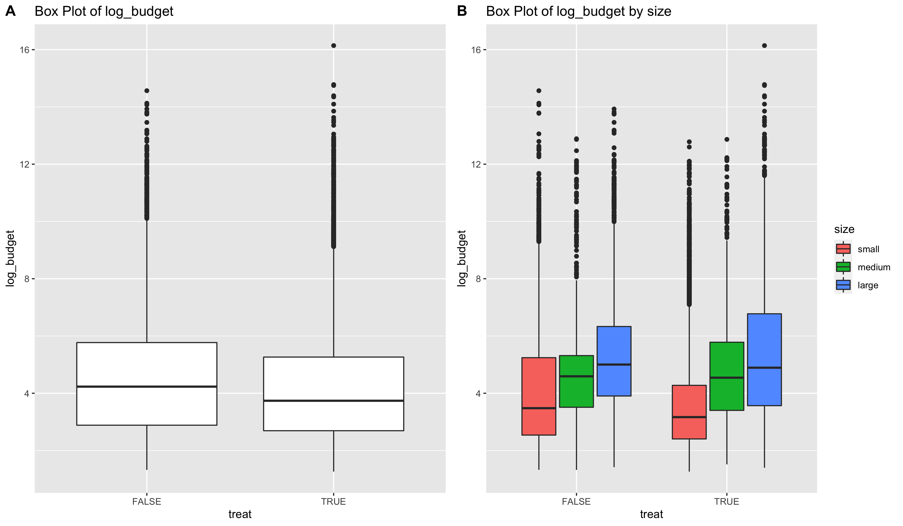
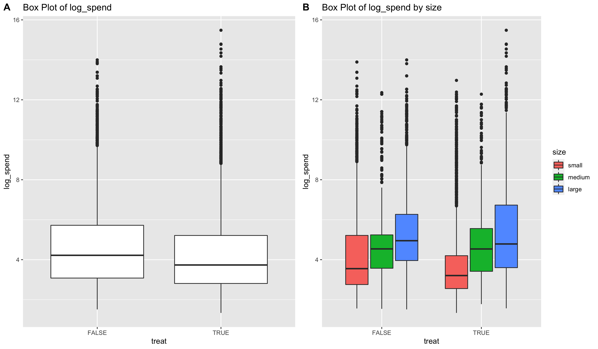
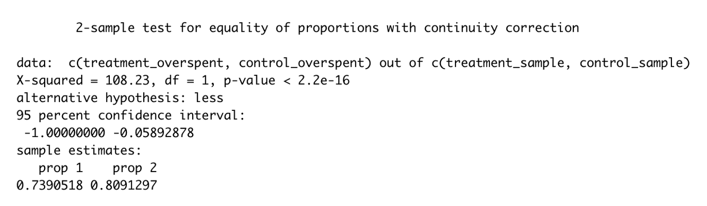
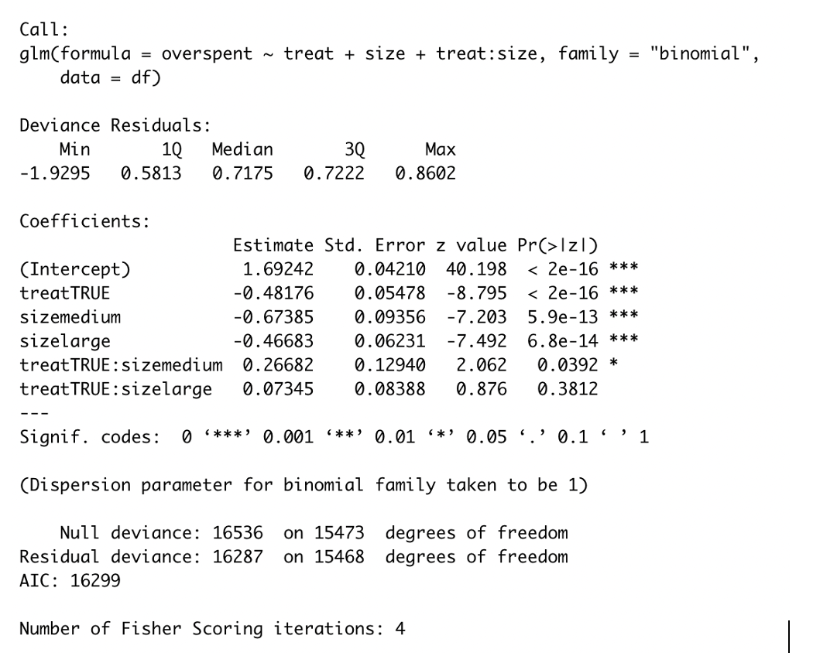
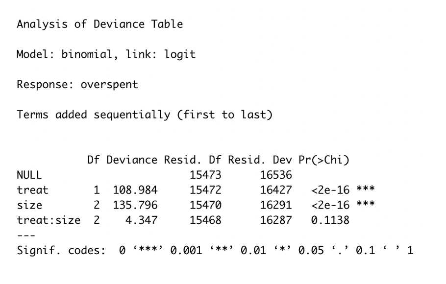
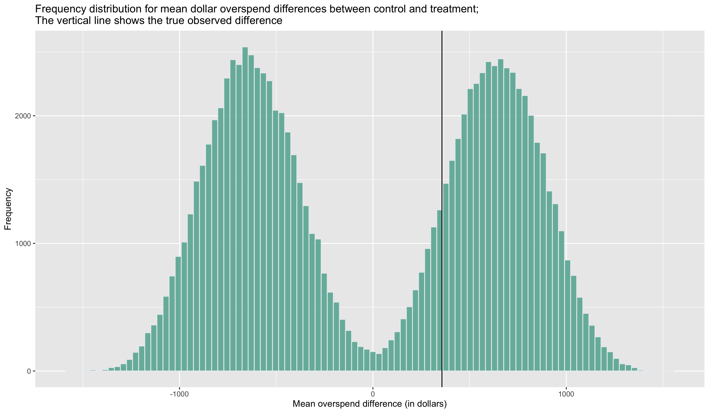
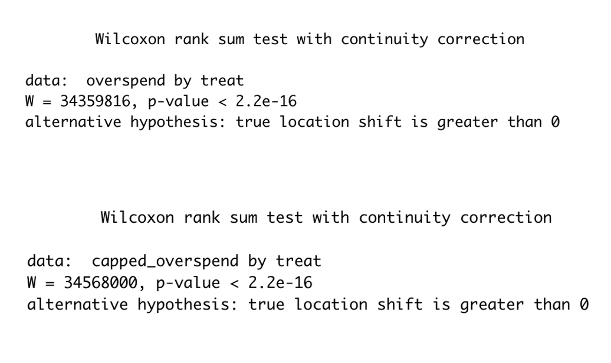

## Introduction

*	A social media company has an ads product on their platform where companies and brands can use to market their products and services.
*	Overspending is a situation where the ads generate more clicks than the company budgets for, and therefore incur a cost to the social medica company. 
*	The social media company therefore hypothesizes that a new advertising product, where companies pay whenever the ad show, will reduce overspending. The data scientists at the company ran an A/B experiment to decide whether this new product is indeed effective.

### Data Exploration

The distributions of ads spending and budget are as follows:

  

  

### Method

To explore the success of the new ads product by assessing whether the new ad product reduces overspending, I looked into two questions:

* Was the new product effective at reducing the proportion of campaigns that overspent? To answer this question, I used a proportion z-test, logistic regression and ANVA to investigate the effects of the new product & company size on the proportion of campaigns that overspent.
*	Was the new product effective at reducing the total overspend dollar? To answer this question, I used a permutation test, and Mann-Whitney-Wilcoxon test to assess whether the mean overspending of the treatment group is smaller than that of the control group.

### Results:

#### Question 1: Was the new product effective at reducing the proportion of campaigns that overspent?

Proportion Z-test result:

  

Logistic Regression result:

  

ANOVA result:

  

Interpretation:

* Keeping all other predictors constant , if the campaign is in the treatment group, the odds of being an overspending campaign will be 1- e^(-0.424) = 34.5% lower, with statistical significance.
* Keeping all other predictors constant, then the odds of being an overspending campaign in medium-sized company is 1-e^(-0.532) = 41.3% lower than in small-sized company (base level), with statistical significance.
* Keeping all other predictors constant, the odds ratio of being an overspending campaign in large-sized company is 1-^(-0.425) = 34.6% lower than in small-sized company (base level), with statistical significance.

#### Question 2: Was the new product effective at reducing the total overspend dollar?

Permutation Test Result (for mean overspending)

  

We can see that the observed difference lies well within the permutation distribution. In fact, the mean difference of random permutations exceeds the observed difference between control and treatment 43.5% of the time, which is far greater than the 5% threshold of significance. Therefore, we don’t have enough evidence to conclude that the mean values of raw overspend differ significantly between the control and treatment group.

Mann-Whitney-Wilcoxon Test for raw overspend (upper) and capped overspend (lower):

  

There is evidence that overspend (both raw and capped) in control group tends to be larger than overspend in the treatment group. However, it is difficult to quantify the result because this is a non-parametric test. Because of inconclusive findings, I recommend running a follow-up test with clearer design and higher power, to investigate further.

### Conclusion

* There are 6,257 out of 7,733 (80.91%) campaigns that overspent in the control group, and 5,180 out of 5,721 (73.91%) campaigns that overspent the treatment group.
* Based on the proportion z-test, there is convincing evidence that the new ad product reduces the proportion of overspending campaign. Based on logistic regression, medium and large company size contribute to a campaign’s lower probability of overspending. 
* However, there is not enough evidence to conclude that the mean overspending amount in the treatment group is lower than the mean overspending amount in the control group, but there is strong evidence that the observations of overspend in the treatment group tend to be smaller than the observations of overspend in the control group, based on the Mann-Whitney-Wilcoxon rank sum test. Because of this inconclusiveness, in order to make inference about mean overspending, it is advisable to run a follow-up test.
* There is evidence for the social media company to be concerned about the lower budget entered for campaigns with the new product, based on a t-test on the means of log transformations of campaign budgets.

### Artifact

* [Github](https://github.com/hnguyen1174/AdsSpending)
* [Project report (draft)](https://github.com/hnguyen1174/AdsSpending/blob/main/report/Report.pdf)

