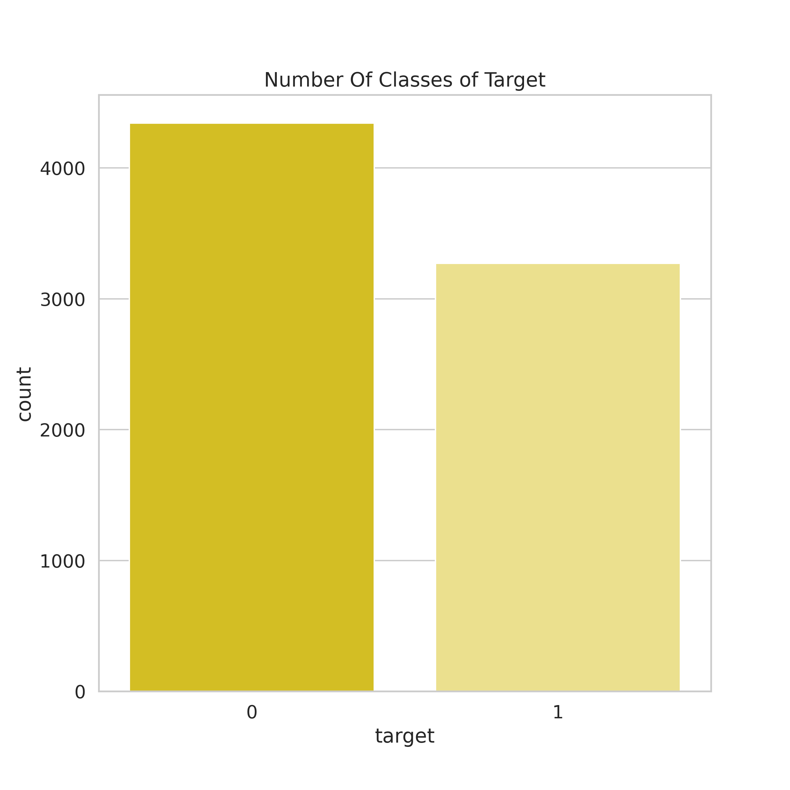
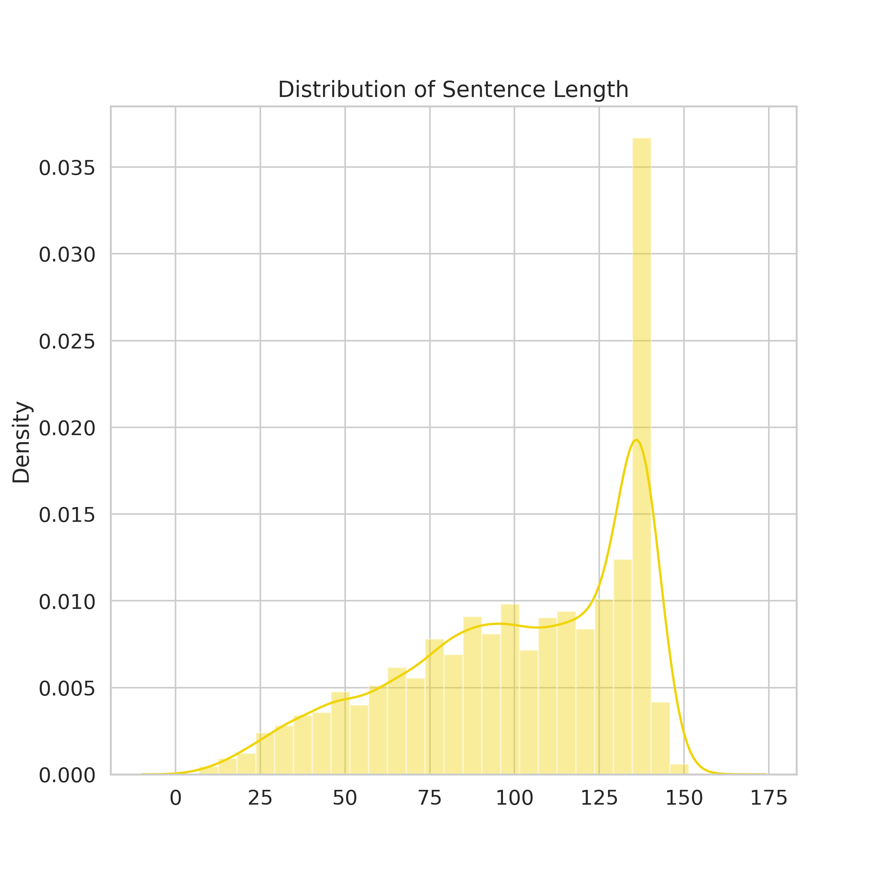
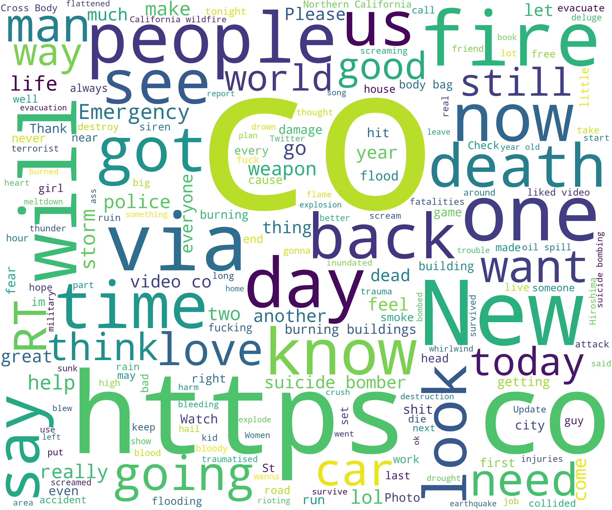

Technologies:

* Python (`transformers` and `transformers_interpret`) for BERT model building
* Streamlit (`streamlit`) for application
* I trained the models by ssh into Google Colab with `colab_ssh` to use GPUs.

### Introduction:

#### Overview

This is a repository based on the [Natural Language Processing with Disaster Tweets](https://www.kaggle.com/c/nlp-getting-started) competition on Kaggle. 

The goal of the competition is to indentify whether a tweet signals true disasters, including man-made or natural ones. This can potentially help disaster relief organizations and news agencies to plan and allocate resources better.

#### Success Metrics

After observing the metrics on the leaderboard, to consider the project a success, one should achieve at least 83% accuracy on an unseen test set.

### Data

The dataset includes 7,613 tweets, in which ~43% are actual disaster-related tweets (so this is a fairly balanced dataset).

  

  

The wordcloud is as follows:

  

### Methods:

Currently, I am applying `BERT` and related models (such as `DistilBERT`, `RoBERTa` and `XLM-BERT`) for this task. Comparing with traditional ML baselines (logistic regression, SVM and Random Forest), transformer models achieve ~5% improvement in accuracy in average. 

I also tried out [Bertweet](https://github.com/VinAIResearch/BERTweet) from VinAI Research, and achieved an additional 0.5% accuracy.

### Results:

#### Model Performance on test set with `train_test_split()`:

Model Performances as of 04/04/2021:

|Model|Text-Preprocessing|Accuracy|Precision|Recall|F1|AUC|
|:--:|:--:|:--:|:--:|:--:|:--:|:--:|
|Dummy|N/A|57.38%|0.00%|0.00%|0.00%|50.00%|
|Logistic Regression|No Preprocessing|79.58%|78.84%|71.19%|74.82%|78.50%|
|Logistic Regression|Preprocessing|78.99%|79.64%|68.10%|73.42%|77.59%|
|SVC|No Preprocessing|77.41%|89.41%|53.31%|66.80%|74.31%|
|SVC|Preprocessing|77.74%|88.37%|55.00%|67.81%|74.81%|
|Random Forest|No Preprocessing|65.20%|97.60%|18.79%|31.52%|59.22%|
|Random Forest|Preprocessing|64.28%|99.07%|16.33%|28.04%|58.11%|
|BERT-Base (e=2, alternate b)|No Preprocessing|84.63%|87.25%|74.88%|80.60%|83.38%|
|BERT-Base (e=1, b=32)|No Preprocessing|82.73%|82.06%|76.11%|78.98%|81.88%|
|BERT-Base (e=2, b=64)|No Preprocessing|82.14%|78.26%|80.43%|79.33%|81.92%|
|DistillBERT-Base (e=2, b=16)|No Preprocessing|84.18%|84.69%|76.73%|80.52%|83.22%|
|DistillBERT-Base (e=1, b=32)|No Preprocessing|82.47%|82.93%|74.11%|78.28%|81.39%|
|DistillBERT-Base (e=5, b=64)|No Preprocessing|82.07%|82.19%|73.96%|77.88%|81.03%|
|RoBERTa-Base (e=2, b=16)|No Preprocessing|83.32%|80.91%|79.66%|80.28%|82.85%|
|RoBERTa-Base (e=2, b=32)|No Preprocessing|82.53%|81.14%|76.88%|78.96%|81.81%|
|RoBERTa-Base (e=1, b=64)|No Preprocessing|81.88%|79.00%|78.27%|78.64%|81.41%|
|RoBERTa-Base (e=2, alternate b)|No Preprocessing|82.40%|78.91%|80.12%|79.51%|82.11%|
|XLM-RoBERTa-Base (e=2, b=16)|No Preprocessing|82.14%|80.95%|75.96%|78.38%|81.34%|
|XLM-RoBERTa-Base (e=2, b=32)|No Preprocessing|82.14%|82.11%|74.27%|77.99%|81.13%|
|XLM-RoBERTa-Base (e=1, b=64)|No Preprocessing|81.88%|79.00%|78.27%|78.38%|81.41%|
|XLM-RoBERTa-Base (e=5, alternate b)|No Preprocessing|81.35%|78.03%|78.27%|78.15%|80.96%|

#### Public Scores

|Score|Rank|Date|Model|
|:--:|:--:|:--:|:--:|
|0.83266|297th|2021-04-04|Bert-Base (Uncased)|
|0.83389|274th|2021-04-04|Bertweet (Uncased), batch size = 8, no dropout|
|0.83481|258th|2021-04-05|Bertweet (Uncased), batch size = 12, with dropout|

### Next Steps:

* [ ] Ensemble or Voting Classifiers for BERT-related models
* [ ] Use BERT Large with model parallelism on AWS EC2/SageMaker
* [X] Bertweet(https://huggingface.co/transformers/model_doc/bertweet.html)
* [ ] Take a deeper look at data processing (maybe search for best combinations of data processing steps)
* [ ] Gradient accumulation.
* [ ] Error Analysis
* [ ] Streamlit

### Artifact

* [Github](https://github.com/hnguyen1174/DisasterTweetsDetector)
* [Huggingface Models](https://huggingface.co/garynguyen1174/disaster_tweet_bert)
